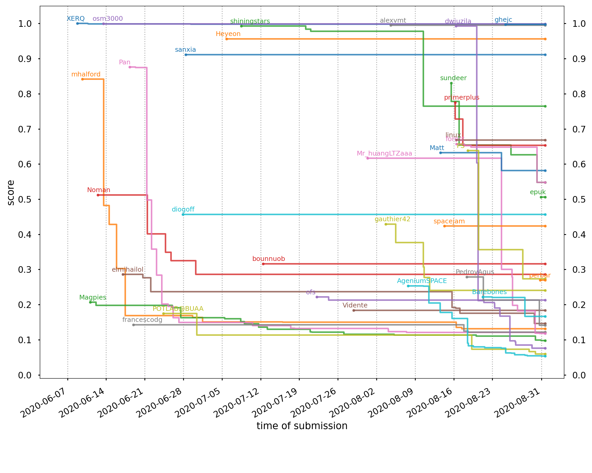

# spotGEO challenge

This repository contains my solution for the [spotGEO challenge](https://kelvins.esa.int/spot-the-geo-satellites/) organized by the Advanced Concepts Team at the European Space Agency. The end goal was to detect satellite positions from sequences of 480x640 grayscale images. I wrote a high-level overview of my solution, which you can find [here](explanation.pdf).

In terms of code, I organised my solution into 6 scripts:

1. [Median calculation](scripts/1_medians.py): this script applies a median filter to each image, and stores the result into the `data/medians` directory.
2. [Interesting pixels](scripts/2_regions.py): I used this script to extract interesting pixels, which are pixels that are brighted than their surroundings. This allowed me to concentrate on a small subset of pixels, and thus lower the computational burden for the rest of the pipeline.
3. [Pixel annotation](scripts/3_annotate.py): this script is responsible for assigning the satellite sightings provided by the competition organisers to the interesting pixels. This makes use of scipy's [`optimize.linear_sum_assignment`](https://docs.scipy.org/doc/scipy/reference/generated/scipy.optimize.linear_sum_assignment.html) function.
4. [Feature extraction](scripts/4_features.py): this script extracts features for each interesting pixel. It's quite straightforward, and simply computes descriptive statistics for each square region surrounding each pixel.
5. [Machine learning](scripts/5_learn.py): this fits a bagged version of LightGBM to the extracted features and the assigned annotations.
6. [Post-processing](scripts/6_score.py): this applies the post-processing step which is described in the penultimate section of the [explanation paper](explanation.pdf). It also computes the out-of-fold performance on the training set by executed the [validation script](validation.py) provided by the competition's organisers.

TLDR:

```sh
python scripts/1_medians.py
python scripts/2_regions.py
python scripts/3_annotate.py
python scripts/4_features.py
python scripts/5_learn.py
python scripts/6_score.py
```

I managed to finish at 7th spot. The following graph shows the rankings over the duration of the competition; my username is `mhalford`:

<div align="center">
  
</div>
